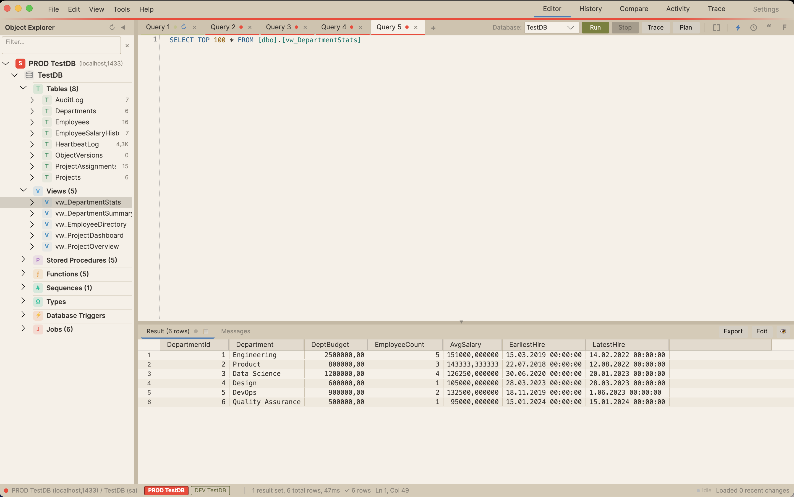
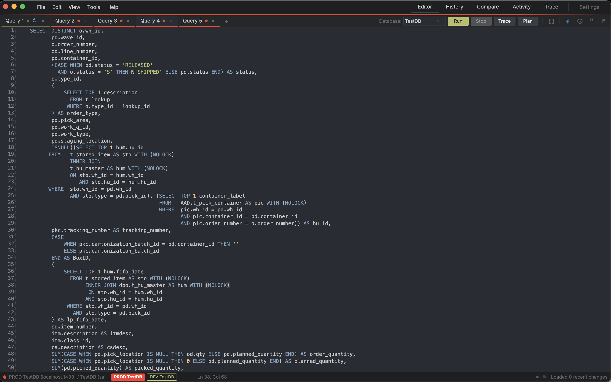
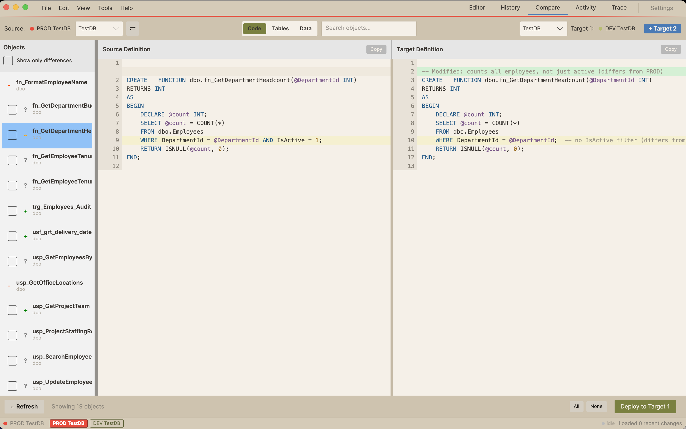

<div align="center">

<picture>
  <source media="(prefers-color-scheme: dark)" srcset="Assets/logo-dark.png">
  
</picture>

# Lookout

**A cross-platform SQL Server desktop IDE — queries, version history, database compare, execution plans, and SQL Agent jobs.**

[](https://github.com/omervaner/SqlVersionControl/releases/latest)
[](https://github.com/omervaner/SqlVersionControl/releases)


</div>

---



For teams that need more than SSMS but less than a full DevOps pipeline. Built with [Avalonia UI](https://avaloniaui.net/) on .NET. Runs natively on macOS (Apple Silicon) and Windows (x64).

## Install

Grab the latest from the [releases page](https://github.com/omervaner/SqlVersionControl/releases/latest).

| Platform | Download |
|---|---|
| macOS (Apple Silicon) | `Lookout-osx-Setup.pkg` installer or `Lookout-osx-Portable.zip` |
| Windows (x64) | `SqlVersionControl-win-Setup.exe` installer or `SqlVersionControl-win-Portable.zip` |

The app auto-updates via [Velopack](https://velopack.io/) — once installed, it picks up new releases on its own.

---

## What's new in v3.0 — SQL formatter overhaul

The formatter is now a `TSqlFragmentVisitor` engine built on `Microsoft.SqlServer.TransactSql.ScriptDom`. It parses your SQL into a real AST and emits with a clause-aware layout — `SELECT` / `FROM` / `WHERE` / `JOIN` keywords right-align in a staircase; subqueries break to indented blocks; `CASE`, `UNION`, `MERGE`, `PIVOT`/`UNPIVOT`, `CREATE/ALTER` for procs/views/functions/triggers/tables all have proper visitor handling. 239 unit tests + a regression harness over a 53-file corpus (51 canonical match / 0 mismatch).



Falls back to the legacy regex-based formatter on parse failure, so production SQL that ScriptDom rejects keeps working. See [CHANGELOG.md](CHANGELOG.md) for the slice-by-slice timeline.

---

## Features

### Query Editor

- **Multi-tab editor** — Each tab owns its own connection. Tab 1 on PROD, Tab 2 on DEV, simultaneously. Drag tabs to reorder; `Cmd+Shift+R` reopens the last closed tab (stack of 10).
- **Run queries** — `F5` or `Cmd+Enter`. `GO` batch splitting, selected-text execution, cancellation. Live elapsed timer in the tab title and status bar.
- **Stacked results** — Multiple result sets render as resizable stacked grids with individual headers; pin a result tab to keep it across re-runs.
- **Editable result grid** — For single-table SELECTs with a primary key, toggle edit mode to modify rows inline. Color-coded change tracking (yellow modified, green new, red deleted), preview generated DML, apply in a single transaction. Identity columns are skipped automatically on INSERT.
- **Copy & export** — Right-click selection: Copy (TSV), Copy as INSERT, Copy with Headers, Export to Excel (`.xlsx` with auto-sized columns and frozen headers). Drag-and-drop `.sql` files from Finder/Explorer onto the editor.
- **Schema-aware autocomplete**, peek definition (`Cmd+Click` on a proc/view/function), find/replace, multi-cursor, column (rectangle) selection (`Option+Drag`), word/line/character zoom (`Cmd+=` / `Cmd+-`).
- **Command palette** (`Cmd+E`) — VS Code-style fuzzy search over every command in the app.
- **Quick Execute** — Right-click a stored procedure to open a new tab with a ready-to-run `EXEC` template — typed `DECLARE` statements with proper precision/scale, `OUTPUT` parameters auto-marked.

### Object Explorer

Collapsible tree across all connected databases. Tables, Views, Stored Procedures, Functions, Sequences, User-Defined Types (scalar + table), Database-Level DDL Triggers, and SQL Agent Jobs. Tables expand to show columns, indexes (with included columns), foreign keys (with cascade actions), and check/default constraints. Views expand to show columns. Procedures and functions expand to show parameters with full type info (`OUTPUT` badge included).

Right-click any object: Script as `CREATE` / `ALTER` / `DROP` / `INSERT`, `SELECT TOP 100`, `SELECT COUNT(*)`, View Definition, Generate `EXEC` with parameter placeholders, `SELECT DISTINCT` on a column, Edit Data, Show Dependencies (Uses / Used By chains with navigation). Filter the tree by typing — 2+ characters queries the server across all databases.

### Version History

DDL audit log–driven version tracking for procs, functions, views, and triggers.

- **Side-by-side diff** between any two versions, syntax-highlighted with red/green line-level diffs.
- **Rollback** any object to a previous version with one click — uses `CREATE OR ALTER` for safe execution.
- **Unified search** — filters by name instantly; after a short pause searches inside definitions too. Code matches are tagged "(in code)".
- **Dependency explorer** — Uses / Used By chains with click-through navigation and a Back button.
- **Auto-sync** — 60-second background polling picks up new DDL changes without interrupting your workflow.

### Database Compare



Compare two — or three — databases across environments and deploy what's drifted.

- **Code Compare** — Side-by-side diff of stored procedures, functions, views, and triggers. Batch-select objects and deploy with `CREATE OR ALTER`.
- **Table Structure Compare** — Column-level diffs (type, nullability, default constraints). Generates the right `CREATE TABLE` or `ALTER TABLE` DDL.
- **Table Data Compare** — Row-level comparison with a configurable match key (defaults to PK). Equalize selected rows by generating `INSERT`/`UPDATE`/`DELETE` wrapped in a transaction with preview before execution. Built for config and reference tables that drift between PROD/UAT/DEV.

### Activity Monitor


Real-time server monitoring on DMV queries.

- **Server health stat cards** — CPU %, memory, buffer cache hit ratio, tempdb usage. Dynamic green/amber/red thresholds.
- **Sessions** — `sp_who` replacement: session ID, login, database, status, CPU, reads/writes, elapsed, blocking chains (transitive — walks `A→B→C` to find true head blockers), running statement. Status pills, filters, kill with safety check (prevents self-kill via `@@SPID`).
- **Jobs Dashboard** — Full SQL Agent management: KPI tiles (Total / Failed 24h / Running / Disabled), color-coded status, human-readable schedules, inline property editor (General / Steps / Schedule / History), Start / Stop / Enable / Disable. Failed-jobs alert badge appears on the sub-tab header when something failed in the last 24 hours.
- **Energy-aware polling** — Auto-refresh pauses when the window or tab is inactive; resumes immediately on focus. Eliminates idle DMV traffic on macOS.

### Trace

Built-in Profiler replacement on Extended Events.

- **Quick Trace** (`Cmd+Shift+F5`) — Run a query with XE tracing and see every internal statement with duration, CPU, and reads.
- **Capture mode** (`Cmd+5`) — Top-level Trace tab with filter setup, start/stop recording, searchable results grid. Active recording is auto-stopped on app close to prevent orphaned XE sessions.

### Execution Plan

Estimated plan visualization with human-readable explanations.

- **Cost breakdown bar** — Horizontal stacked bar showing operator costs proportionally, color-coded by type, clickable.
- **Operator tree** — Plain-English labels like *"Reading entire table: Orders (slow — no filter used)"* instead of raw operator names. Raw names available in tooltips for DBAs.
- **Code-to-plan linking** — Click an operator to highlight the corresponding statement in the editor.
- **Warnings panel** — Implicit conversions, spills, etc.
- **Missing indexes** — Suggestions with a "Copy `CREATE INDEX`" button.

Powered by [PlanViewer.Core](https://github.com/erikdarlingdata/PerformanceStudio) (MIT, vendored as a submodule).

### Index Analysis

Three-tab DMV analysis (Tools → Index Analysis):

- **Unused Indexes** — Indexes with low reads but high write overhead. Removal candidates.
- **Missing Indexes** — SQL Server's optimizer suggestions, ranked by impact score.
- **Duplicate / Overlapping Indexes** — Indexes covering the same columns.

Each tab supports `DROP` / `CREATE` script generation and CSV export.

### Tools

- **SQL Formatter** (`Cmd+Shift+F`) — The v3.0 visitor engine described above.
- **Text Compare** — Paste two blocks of text, get a side-by-side diff with the same engine the database compare uses.
- **SQL Quoter** — Paste a list of values, get a formatted `IN (...)` clause.
- **Quick Quote** (`Cmd+Shift+Q`) — Wrap selected text in quotes in-place.
- **Comment / Uncomment** (`Cmd+K` / `Cmd+L`), **uppercase / lowercase** (`Cmd+Shift+U` / `Cmd+Shift+L`), **move line up/down** (`Alt+Up`/`Alt+Down`).

### Git Export

File → Export to Git. Snapshot every database object as `.sql` files in a local Git repo, organized by schema. Change detection only writes files that actually changed; deleted objects' files are removed; an auto-generated `CHANGELOG.md` carries timestamps.

### Connections

- **Connection Manager** (`Cmd+Shift+M`) — Central registry with environment classification (PROD / DEV / QA / UAT / Test), color tagging, and a test-connection button. Typing "PROD" or "DEV" in the name auto-detects the environment.
- **Environment colors propagate everywhere** — connection chip in the status bar, dot on the query tab, stripe across the top, and per-server colors on Source / Target in the Compare tab.
- **Encrypted credential storage** — DPAPI on Windows, AES on macOS. Survives app restarts.
- **Smart reconnect after sleep** — On wake, all registry connections are re-tested and silently reconnected with stored credentials.
- **Per-connection `TrustServerCertificate`** — Configurable per entry, defaults to true.
- **Configurable connection timeout** — 1–120 seconds in Settings.

### Quality of Life

- **Dark theme + warm cream light theme** with live preview. Toggle with `Cmd+Shift+T`.
- **Session restore** — Tabs, connections, editor contents, and result-tab pins are saved on exit and restored on next launch.
- **Crash reporter** — Global exception handlers, structured crash logs, red banner on next startup if the previous run crashed.
- **Application logging** — `logs/app.log` in the app data folder, 5 MB rotation.
- **PerMonitorV2 DPI awareness** on Windows for sharp rendering at all display scaling levels.
- **Keyboard shortcuts dialog** (`Help → Keyboard Shortcuts`) and full reference in [docs/SHORTCUTS.md](docs/SHORTCUTS.md).

---

## Build from Source

Requires the [.NET SDK](https://dotnet.microsoft.com/download). The project multi-targets `net9.0` and `net10.0`.

```bash
git clone --recurse-submodules https://github.com/omervaner/SqlVersionControl.git
cd SqlVersionControl
dotnet run -f net10.0    # or -f net9.0 if you don't have the .NET 10 SDK
```

### Release Build

Releases are published with `-f net9.0` so the binary runs on both runtimes.

```bash
# macOS (Apple Silicon)
dotnet publish -c Release -r osx-arm64 --self-contained -f net9.0 -o publish/osx-arm64

# Windows (x64)
dotnet publish -c Release -r win-x64 --self-contained -f net9.0 -o publish/win-x64
```

CI (`.github/workflows/release.yml`) builds both platforms on tag push and publishes a Velopack auto-update feed alongside the GitHub release.

---

## Tech Stack

| | |
|---|---|
| **UI Framework** | [Avalonia UI](https://avaloniaui.net/) 11.x |
| **Runtime** | .NET 9 / 10 (multi-targeted) |
| **MVVM** | [CommunityToolkit.Mvvm](https://github.com/CommunityToolkit/dotnet) |
| **SQL Client** | [Microsoft.Data.SqlClient](https://github.com/dotnet/SqlClient) |
| **SQL Parser / Formatter** | [`Microsoft.SqlServer.TransactSql.ScriptDom`](https://www.nuget.org/packages/Microsoft.SqlServer.TransactSql.ScriptDom) (visitor engine, v3.0+) |
| **Editor** | [AvaloniaEdit](https://github.com/AvaloniaUI/AvaloniaEdit) |
| **Diff Engine** | [DiffPlex](https://github.com/mmanela/diffplex) |
| **Execution Plans** | [PlanViewer.Core](https://github.com/erikdarlingdata/PerformanceStudio) (MIT) |
| **Excel Export** | [ClosedXML](https://github.com/ClosedXML/ClosedXML) |
| **Auto-Update** | [Velopack](https://velopack.io/) |

---

## Documentation

- [CHANGELOG.md](CHANGELOG.md) — Full version history.
- [docs/SHORTCUTS.md](docs/SHORTCUTS.md) — Every keyboard shortcut.
- [docs/FORMATTER-INTERNALS.md](docs/FORMATTER-INTERNALS.md) — How the v3.0 SQL formatter works internally.
- [docs/HISTORY-GIT-INTEGRATION.md](docs/HISTORY-GIT-INTEGRATION.md) — Git export design.
- [docs/SERVER-HEALTH.md](docs/SERVER-HEALTH.md) — Activity Monitor DMV queries.
