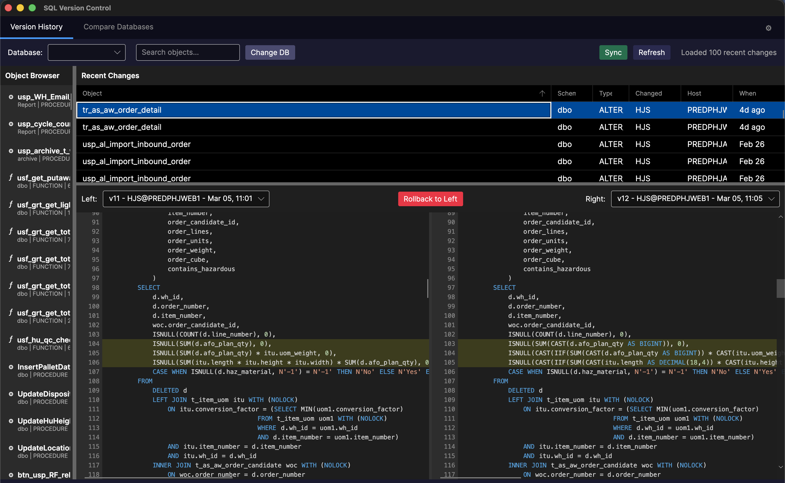

# SQL Version Control

A cross-platform desktop app for tracking DDL changes in SQL Server databases. Browse version history, view side-by-side diffs, roll back to previous versions, and compare/deploy objects across databases.



## Features

- **Version History** — Browse all changes to stored procedures, functions, views, and triggers. See who changed what and when.
- **Side-by-Side Diff** — Compare any two versions with syntax highlighting and red/green line highlighting.
- **Rollback** — Restore any previous version with a single click.
- **Database Compare** — Compare objects between two or three databases and deploy differences.
- **Batch Deploy** — Select multiple objects and deploy them all at once with `CREATE OR ALTER` for safe, idempotent execution.
- **Object Browser** — Searchable tree of all database objects with version counts.
- **Dark & Light Themes** — Full theme support with live preview.

## Install

Download the latest release for your platform from [Releases](https://github.com/omervaner/SqlVersionControl/releases):

| Platform | File |
|----------|------|
| macOS (Apple Silicon) | `SqlVersionControl-macOS.dmg` |
| Windows (x64) | `SqlVersionControl-win-x64.exe` |

## Build from Source

Requires [.NET 9 SDK](https://dotnet.microsoft.com/download/dotnet/9.0).

```bash
git clone https://github.com/omervaner/SqlVersionControl.git
cd SqlVersionControl
dotnet run
```

### Publish

```bash
# macOS ARM64
dotnet publish -c Release -r osx-arm64 --self-contained -o publish/osx-arm64

# Windows x64 (single file)
dotnet publish -c Release -r win-x64 --self-contained -p:PublishSingleFile=true -p:IncludeNativeLibrariesForSelfExtract=true -o publish/win-x64-single
```

## Tech Stack

[Avalonia UI](https://avaloniaui.net/) | .NET 9 | [DiffPlex](https://github.com/mmanela/diffplex) | [AvaloniaEdit](https://github.com/AvaloniaUI/AvaloniaEdit) | CommunityToolkit.Mvvm
